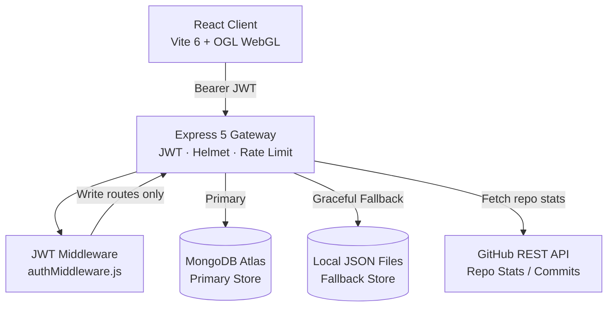

<p align="center">
  <a href="https://github.com/Can-Startora/Startora">
    
  </a>
</p>

<h1 align="center">Startora — Landing Web</h1>

<p align="center">
  <em>The open-source startup operating system for student founders.</em>
</p>

<p align="center">
  <a href="https://github.com/Can-Startora/Startora-landing-web/blob/main/LICENSE">
    
  </a>
  <a href="https://github.com/Can-Startora/Startora-landing-web/actions">
    
  </a>
  
  
  
  
</p>

<p align="center">
  <b>This repo is the landing page.</b> Looking for the core platform?<br/>
  👉 <a href="https://github.com/Can-Startora/Startora"><strong>Can-Startora/Startora</strong></a>
</p>

---

## What is Startora?

Startora is an **open-source startup operating system** for university students. Think GitHub meets LinkedIn meets Y Combinator — built to help student founders:

- 🤝 **Discover co-founders** across disciplines and institutions
- 💡 **Validate ideas** with cryptographic IP protection (SHA-256 on-chain fingerprints)
- 🧠 **Get AI feedback** on market viability and technical feasibility in seconds
- 🗳️ **Pitch to the community** and get funded via DAO consensus voting

---

## Live Features on this Landing Page

| Component | Description |
|---|---|
| `InfiniteMenu` | Hardware-accelerated WebGL rotating sphere with 30 startup categories using Fibonacci Sphere Distribution |
| `ContributorConstellation` | Live GitHub API-powered contributor galaxy visualisation |
| `ContributorPortal` | JWT-authenticated contributor registration & login system |
| `DaoProposalSim` | Interactive DAO voting simulator with live proposal state |
| `CommunityQA` | Real-time Q&A board backed by MongoDB / JSON fallback |
| `MagicBento` | Animated glassmorphic feature showcase grid |
| `TerminalSimulator` | Git-like live console shell simulating dev workflows |
| `Galaxy` | WebGL particle background with OGL renderer |
| `ExploreModal` | Category explorer with startup ecosystem mapping |

---

## Technology Stack

### Frontend
| Library | Version | Purpose |
|---|---|---|
| React | 18 | UI framework |
| Vite | **6.4.3** | Build tool & dev server |
| GSAP / `@gsap/react` | 3.15 | Timeline animations |
| `motion` (Framer Motion) | 12 | Declarative UI animations |
| OGL | 1.0 | Lightweight WebGL renderer |
| GL-Matrix | 3.4 | Matrix math for 3D |
| Lucide React | 1.17 | Icon system |

### Backend
| Library | Version | Purpose |
|---|---|---|
| Express | 5.2 | HTTP server & routing |
| Mongoose | 9.8 | MongoDB ODM |
| `jsonwebtoken` | — | JWT auth tokens |
| `bcryptjs` | 3.0 | Password hashing (12 rounds) |
| `helmet` | — | HTTP security headers |
| `cors` | 2.8 | Origin-restricted CORS |
| `express-rate-limit` | 8.5 | Rate limiting |
| `dotenv` | 17 | Environment config |

---

## Architecture



### Security Architecture

| Layer | Control |
|---|---|
| HTTPS transport | Enforced via HSTS (`Strict-Transport-Security`) |
| Origin restriction | `ALLOWED_ORIGINS` env var whitelist (no wildcard CORS) |
| Auth | JWT Bearer tokens issued on login/register, 7-day expiry |
| Rate limiting | Auth routes: 5 req/15 min · API routes: 100 req/15 min |
| Input validation | Length caps on all fields + category allowlist |
| Password storage | bcrypt, cost factor 12 |
| Security headers | `helmet()` — CSP, X-Frame-Options, X-Content-Type-Options |
| Vote integrity | Server-side `$inc`, double-vote prevention via JWT user ID |
| IDs | `crypto.randomUUID()` — no enumerable sequential IDs |
| Dependency CVEs | `npm audit` — **0 vulnerabilities** |
| Git history | Scrubbed with `git-filter-repo` — no secrets in history |

---

## Getting Started

### Prerequisites

- [Node.js](https://nodejs.org/) **v18+**
- `npm` v9+
- A [MongoDB Atlas](https://www.mongodb.com/cloud/atlas) cluster (or use the local JSON fallback)

### Installation

```bash
# 1. Clone the repo
git clone git@github.com:Can-Startora/Startora-landing-web.git
cd Startora-landing-web

# 2. Install dependencies
npm install

# 3. Set up environment variables
cp .env.example .env
# Edit .env — fill in MONGODB_URI and generate a JWT_SECRET (see below)
```

### Environment Variables

```bash
# .env
MONGODB_URI=mongodb+srv://<user>:<pass>@<cluster>.mongodb.net/
PORT=3001

# Generate with: node -e "console.log(require('crypto').randomBytes(48).toString('hex'))"
JWT_SECRET=<your-96-char-hex-secret>
JWT_EXPIRES_IN=7d

# Comma-separated allowed origins (no trailing slash)
ALLOWED_ORIGINS=http://localhost:5173,http://localhost:4173

NODE_ENV=development
```

> ⚠️ **Never commit your `.env` file.** It is already in `.gitignore`.

### Running Locally

```bash
# Start both the backend API and Vite dev server
npm run dev

# Or run them separately:
npm run server       # Express API on :3001
npx vite --host      # Vite on :5173
```

### Production Build

```bash
npm run build        # Outputs to dist/
npm run preview      # Preview the production build
```

---

## Project Structure

```
Startora-landing-web/
├── backend/
│   ├── config/
│   │   └── db.js                 # MongoDB connection + JSON fallback helpers
│   ├── controllers/
│   │   ├── userController.js     # Register / Login + JWT issuance
│   │   ├── suggestionController.js
│   │   ├── questionController.js
│   │   ├── ideaController.js
│   │   └── githubController.js   # Async GitHub API + git log
│   ├── middleware/
│   │   └── auth.js               # JWT Bearer verification middleware
│   ├── routes/
│   │   ├── userRoutes.js         # POST /register, POST /login (rate-limited)
│   │   ├── suggestionRoutes.js   # GET (public) · POST + PATCH (auth required)
│   │   ├── questionRoutes.js     # GET (public) · POST (auth required)
│   │   ├── ideaRoutes.js         # GET (public) · POST (auth required)
│   │   └── githubRoutes.js       # GET /repo-stats (public)
│   ├── data/                     # JSON fallback data files
│   └── server.js                 # App entry — helmet, CORS, rate limit, routes
├── src/
│   ├── components/               # All React components
│   ├── styles/                   # Component CSS files
│   ├── assets/                   # Images and static assets
│   ├── config.js                 # API_BASE_URL config
│   ├── App.jsx                   # Root app component
│   └── main.jsx                  # React entry point
├── public/                       # Static public assets
├── .env.example                  # Environment variable template
├── .gitignore
├── vite.config.js
└── package.json
```

---

## API Reference

All write endpoints require an `Authorization: Bearer <token>` header obtained from `/api/users/login` or `/api/users/register`.

| Method | Endpoint | Auth | Description |
|---|---|---|---|
| `POST` | `/api/users/register` | No | Register a new contributor |
| `POST` | `/api/users/login` | No | Login and receive JWT |
| `GET` | `/api/suggestions` | No | List all suggestions |
| `POST` | `/api/suggestions` | ✅ Yes | Create a suggestion |
| `POST` | `/api/suggestions/:id/vote` | ✅ Yes | Cast a vote (`yes`/`no`) |
| `GET` | `/api/questions` | No | List all questions |
| `POST` | `/api/questions` | ✅ Yes | Ask a question |
| `POST` | `/api/questions/:id/answers` | ✅ Yes | Answer a question |
| `GET` | `/api/ideas?category=<cat>` | No | List ideas by category |
| `POST` | `/api/ideas` | ✅ Yes | Submit an idea |
| `GET` | `/api/repo-stats` | No | Live GitHub repo statistics |

---

## Contributing

Startora is built for the open-source future. Every feature is decided democratically via token-weighted community consensus.

1. Fork the project
2. Create your feature branch: `git checkout -b feature/AmazingFeature`
3. Commit your changes: `git commit -m 'feat: add AmazingFeature'`
4. Push to the branch: `git push origin feature/AmazingFeature`
5. Open a Pull Request against `main`

Please make sure `npm audit` reports **0 vulnerabilities** before submitting.

---

## Community

<a href="https://discord.gg/WsUCXPxnZ">
  
</a>

💬 **[Join the Startora Discord Community →](https://discord.gg/WsUCXPxnZ)**

---

## License

This project is licensed under the **MIT License** — see the [LICENSE](LICENSE) file for details.
